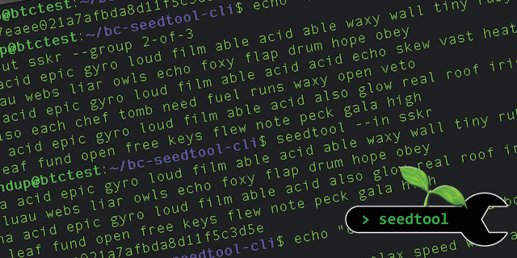

# 🌱 Blockchain Commons bc-seedtool-cli


### _by [Wolf McNally](https://www.github.com/wolfmcnally) and [Christopher Allen](https://www.github.com/ChristopherA)_

* &nbsp;&nbsp; ***part of the [crypto commons](https://github.com/BlockchainCommons/crypto-commons/blob/master/README.md) technology family***

<p align="center">
  
</p>

## Introduction

`seedtool` is a command-line tool for creating and transforming cryptographic seeds of the sort commonly used by blockchain applications.

It exercises the various cryptographic C libraries created by Blockchain Commons, as described in the Dependencies section.

## Status - Feature-Complete Beta

Seedtool is now considered feature-complete and is entering beta-level testing.

## Dependencies

Seedtool exercises the following Blockchain Commons libraries:

* [`bc-crypto-base`](https://github.com/blockchaincommons/bc-crypto-base)
* [`bc-shamir`](https://github.com/blockchaincommons/bc-shamir)
* [`bc-sskr`](https://github.com/blockchaincommons/bc-sskr)
* [`bc-bip39`](https://github.com/blockchaincommons/bc-bip39)
* [`bc-ur`](https://github.com/blockchaincommons/bc-ur)

It also requires the following additional programs:

* [`GNU argp`](https://www.gnu.org/software/libc/manual/html_node/Argp.html)
* [`CBOR Lite`](https://bitbucket.org/isode/cbor-lite)

### Tool Dependencies

To build `seedtool` you'll need to use the following tools:

- autotools - Gnu Build System from Free Software Foundation ([intro](https://www.gnu.org/software/automake/manual/html_node/Autotools-Introduction.html)).

## Recommended Installation instructions

The dependencies will be automatically installed as submodules when you run the build script. This is the recommended way to install.

### Build with Docker

[Install docker](https://docs.docker.com/get-docker/) and run:

```bash
# Build the image
$ docker build -t bc-seedtool-cli .
# Run the container
$ docker run --rm -it bc-seedtool-cli --help
```

### Build on MacOS

```bash
$ brew install autoconf automake libtool
```

You must then download or clone this repo. Afterward, cd into the repo directory and:

```bash
$ ./build.sh
$ sudo make install
```

### Build on Linux

Make sure you have `llvm`/`clang`, `libc++` and `libc++abi` installed, all with
a minimum recommended version 10.

#### Build on Ubuntu and Debian

```bash
$ sudo apt install build-essential

$ wget https://apt.llvm.org/llvm.sh
$ chmod +x llvm.sh
$ sudo apt install lsb-release wget software-properties-common
$ sudo ./llvm.sh 10  # version 10

$ sudo apt-get install libc++-10-dev libc++abi-10-dev
```

```bash
$ sudo apt-get install git
$ git clone https://github.com/BlockchainCommons/bc-seedtool-cli.git
$ cd bc-seedtool-cli/  
$ export CC="clang-10" && export CXX="clang++-10" && ./build.sh
$ sudo make install
```

### Build on Windows

See [instructions here](Docs/Install-Windows.md).

## Alternative Installation Instructions

The following sequence does *not* install the dependencies from submodules; instead they must be installed in the usual places on the build system, otherwise the `./configure` step below will fail.

```bash
$ ./configure
$ make
$ sudo make install
```
*Note:* On Linux the first step is `./configure CC=clang-10 CXX=clang++-10`

## Incremental Build Instructions

If you wish to make changes to the source code and rebuild:

```bash
# Make source changes
$ source set_build_paths.sh # sets shell variables used by make
$ make clean # If you want a clean build
$ make
```

## Usage Instructions

See [usage examples](Docs/Usage.md) for examples of using seedtool.

## Full Documentation

See [`MANUAL.md`](Docs/MANUAL.md) for details, many more examples, and version history.

## Notes for Maintainers

Before accepting a PR that can affect build or unit tests, make sure the following sequence of commands succeeds:

```bash
$ ./build.sh
$ make lint
$ make check
$ make distclean
```

`make lint` uses [Cppcheck](https://en.wikipedia.org/wiki/Cppcheck) to perform static analysis on the code. All PRs should pass with no warnings.

## Related Projects

* [LetheKit](https://github.com/BlockchainCommons/bc-lethekit) is a parallel project that uses many of the same libraries, but in hardware.
* [URKit](https://github.com/BlockchainCommons/URKit) is another example of our [bc-ur](https://github.com/BlockchainCommons/bc-ur) universal-reference library.

## Origin, Authors, Copyright & Licenses

Unless otherwise noted (either in this [/README.md](./README.md) or in the file's header comments) the contents of this repository are Copyright © 2020 by Blockchain Commons, LLC, and are [licensed](./LICENSE) under the [spdx:BSD-2-Clause Plus Patent License](https://spdx.org/licenses/BSD-2-Clause-Patent.html).

In most cases, the authors, copyright, and license for each file reside in header comments in the source code. When it does not we have attempted to attribute it accurately in the table below.

This table below also establishes provenance (repository of origin, permalink, and commit id) for files included from repositories that are outside of this repository. Contributors to these files are listed in the commit history for each repository, first with changes found in the commit history of this repo, then in changes in the commit history of their repo of their origin.

| File      | From                                                         | Commit                                                       | Authors & Copyright (c)                                | License                                                     |
| --------- | ------------------------------------------------------------ | ------------------------------------------------------------ | ------------------------------------------------------ | ----------------------------------------------------------- |
| hkdf.c | [rustyrussell/ccan](https://github.com/rustyrussell/ccan/blob/master/ccan/crypto/hkdf_sha256/hkdf_sha256.c) | [d07f742](https://github.com/rustyrussell/ccan/commit/d07f742c5925b97ed558eb07aae285616f5df823) | 2016 [Rusty Russell](https://github.com/rustyrussell)<br/>2020 Wolf McNally | [MIT](https://github.com/rustyrussell/ccan/blob/master/ccan/crypto/hkdf_sha256/LICENSE)
| hkdf.h | [rustyrussell/ccan](https://github.com/rustyrussell/ccan/blob/master/ccan/crypto/hkdf_sha256/hkdf_sha256.h) | [d07f742](https://github.com/rustyrussell/ccan/commit/d07f742c5925b97ed558eb07aae285616f5df823) | 2016 [Rusty Russell](https://github.com/rustyrussell) | [MIT](https://github.com/rustyrussell/ccan/blob/master/ccan/crypto/hkdf_sha256/LICENSE)
| randombytes.c | [dsprenkels/randombytes](https://github.com/dsprenkels/randombytes/blob/master/randombytes.c) | [6db39aa](https://github.com/dsprenkels/randombytes/commit/6db39aaae6bb9ab97beca00d81bcfe935c56c88d) | 2017-2019 [Daan Sprenkels](https://github.com/dsprenkels/) | [MIT](https://github.com/dsprenkels/randombytes/commit/73ae9b4fce2e62babdd6a480b53ad449dd745ed9) |
| randombytes.h | [dsprenkels/randombytes](https://github.com/dsprenkels/randombytes/blob/master/randombytes.h) | [19fd002](https://github.com/dsprenkels/randombytes/commit/19fd002d9b7b001b333a671186a91231b60d821b) | 2017-2019 [Daan Sprenkels](https://github.com/dsprenkels/) | [MIT](https://github.com/dsprenkels/randombytes/commit/73ae9b4fce2e62babdd6a480b53ad449dd745ed9) |

### Tool Dependencies

To build `seedtool` you'll need to use the following tools:

- autotools - Gnu Build System from Free Software Foundation ([intro](https://www.gnu.org/software/automake/manual/html_node/Autotools-Introduction.html)).

## Financial Support

Seedtool is a project of [Blockchain Commons](https://www.blockchaincommons.com/). We are proudly a "not-for-profit" social benefit corporation committed to open source & open development. Our work is funded entirely by donations and collaborative partnerships with people like you. Every contribution will be spent on building open tools, technologies, and techniques that sustain and advance blockchain and internet security infrastructure and promote an open web.

To financially support further development of Seedtool and other projects, please consider becoming a Patron of Blockchain Commons through ongoing monthly patronage as a [GitHub Sponsor](https://github.com/sponsors/BlockchainCommons). You can also support Blockchain Commons with bitcoins at our [BTCPay Server](https://btcpay.blockchaincommons.com/).

## Contributing

We encourage public contributions through issues and pull-requests! Please review [CONTRIBUTING.md](./CONTRIBUTING.md) for details on our development process. All contributions to this repository require a GPG signed [Contributor License Agreement](./CLA.md).

### Discussions

The best place to talk about Blockchain Commons and its projects is in our GitHub Discussions areas.

[**Wallet Standard Discussions**](https://github.com/BlockchainCommons/AirgappedSigning/discussions). For standards and open-source developers who want to talk about wallet standards, please use the Discussions area of the [Airgapped Signing repo](https://github.com/BlockchainCommons/AirgappedSigning). This is where you can talk about projects like our [LetheKit](https://github.com/BlockchainCommons/bc-lethekit) and command line tools such as [seedtool](https://github.com/BlockchainCommons/bc-seedtool-cli), both of which are intended to testbed wallet technologies, plus the libraries that we've built to support your own deployment of wallet technology such as [bc-bip39](https://github.com/BlockchainCommons/bc-bip39), [bc-slip39](https://github.com/BlockchainCommons/bc-slip39), [bc-shamir](https://github.com/BlockchainCommons/bc-shamir), [Sharded Secret Key Reconstruction](https://github.com/BlockchainCommons/bc-sskr), [bc-ur](https://github.com/BlockchainCommons/bc-ur), and the [bc-crypto-base](https://github.com/BlockchainCommons/bc-crypto-base). If it's a wallet-focused technology or a more general discussion of wallet standards,discuss it here.

[**Blockchain Commons Discussions**](https://github.com/BlockchainCommons/Community/discussions). For developers, interns, and patrons of Blockchain Commons, please use the discussions area of the [Community repo](https://github.com/BlockchainCommons/Community) to talk about general Blockchain Commons issues, the intern program, or topics other than the [Gordian System](https://github.com/BlockchainCommons/Gordian/discussions) or the [wallet standards](https://github.com/BlockchainCommons/AirgappedSigning/discussions), each of which have their own discussion areas.

### Other Questions & Problems

As an open-source, open-development community, Blockchain Commons does not have the resources to provide direct support of our projects. Please consider the discussions area as a locale where you might get answers to questions. Alternatively, please use this repository's [issues](./issues) feature. Unfortunately, we can not make any promises on response time.

If your company requires support to use our projects, please feel free to contact us directly about options. We may be able to offer you a contract for support from one of our contributors, or we might be able to point you to another entity who can offer the contractual support that you need.

### Credits

The following people directly contributed to this repository. You can add your name here by getting involved — the first step is to learn how to contribute from our [CONTRIBUTING.md](./CONTRIBUTING.md) documentation.

| Name              | Role                | Github                                            | Email                                 | GPG Fingerprint                                    |
| ----------------- | ------------------- | ------------------------------------------------- | ------------------------------------- | -------------------------------------------------- |
| Christopher Allen | Principal Architect | [@ChristopherA](https://github.com/ChristopherA) | \<ChristopherA@LifeWithAlacrity.com\> | FDFE 14A5 4ECB 30FC 5D22  74EF F8D3 6C91 3574 05ED |
| Wolf McNally      | Project Lead        | [@WolfMcNally](https://github.com/wolfmcnally)    | \<Wolf@WolfMcNally.com\>              | 9436 52EE 3844 1760 C3DC  3536 4B6C 2FCF 8947 80AE |

## Responsible Disclosure

We want to keep all our software safe for everyone. If you have discovered a security vulnerability, we appreciate your help in disclosing it to us in a responsible manner. We are unfortunately not able to offer bug bounties at this time.

We do ask that you offer us good faith and use best efforts not to leak information or harm any user, their data, or our developer community. Please give us a reasonable amount of time to fix the issue before you publish it. Do not defraud our users or us in the process of discovery. We promise not to bring legal action against researchers who point out a problem provided they do their best to follow the these guidelines.

## Reporting a Vulnerability

Please report suspected security vulnerabilities in private via email to ChristopherA@BlockchainCommons.com (do not use this email for support). Please do NOT create publicly viewable issues for suspected security vulnerabilities.

The following keys may be used to communicate sensitive information to developers:

| Name              | Fingerprint                                        |
| ----------------- | -------------------------------------------------- |
| Christopher Allen | FDFE 14A5 4ECB 30FC 5D22  74EF F8D3 6C91 3574 05ED |

You can import a key by running the following command with that individual’s fingerprint: `gpg --recv-keys "<fingerprint>"` Ensure that you put quotes around fingerprints that contain spaces.
